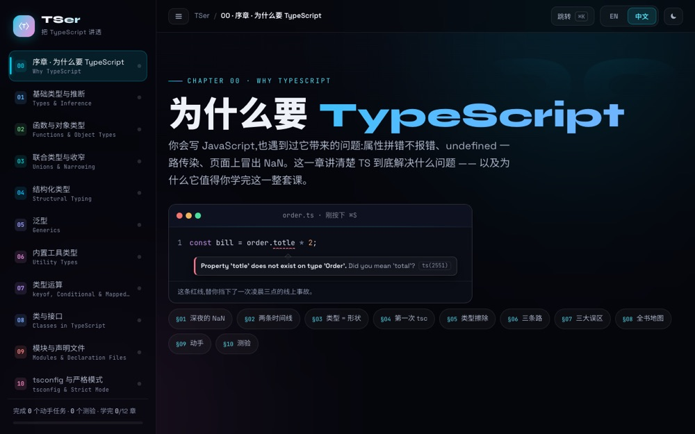

# TSer — an interactive TypeScript course

**▶ [Open the course](https://tser.vercel.app)** — runs in your browser, nothing to install.

An interactive TypeScript course covering the motivation for types, compiler feedback,
application-level type design, and an introduction to type-level programming.

Sister sites: [APIer](https://apier-eta.vercel.app) (APIs) and
[DataData](https://data-data.vercel.app) (data structures) — same design language.



*The course home — 12 chapters from inference to type-level programming*


*Generics, with code you can paste into the Playground*

## Chapters

| # | Chapter | What it covers |
|---|---|---|
| 00 | Why TypeScript | The cost of finding out at runtime · types as a checkpoint · type erasure · your first `tsc` |
| 01 | Basic types and inference | Primitives · arrays and objects · literal types · annotation vs. inference · the pull of `any` |
| 02 | Functions and object types | Parameters and returns · optional and default · `interface` vs. `type` · `readonly` |
| 03 | Unions and narrowing | Unions · `typeof`/`in`/`instanceof` · discriminated unions · exhaustiveness with `never` |
| 04 | Structural typing | Duck typing · assignability · excess property checks · nominal typing compared |
| 05 | Generics | Generic functions · `extends` constraints · generic interfaces · common misconceptions |
| 06 | Built-in utility types | `Partial` · `Pick` · `Omit` · `Record` · `ReturnType` · `Awaited` |
| 07 | Type operators | `keyof` · `typeof` · indexed access · conditional types · `infer` · mapped types |
| 08 | Classes and interfaces | Access modifiers · parameter properties · `abstract` · `implements` |
| 09 | Modules and declaration files | `import type` · `.d.ts` · `declare` · `@types` · DefinitelyTyped |
| 10 | tsconfig and strict mode | The strict family · `target`/`module` · migrating gradually |
| ✦ | Finale — thinking in types | `satisfies` · `as const` · `unknown` as the safe default · type challenges · final quiz |

Each chapter follows the same rhythm: an intuition first, then an interactive
visualization, then code you can paste into the TypeScript Playground, then the common mistakes, then a hands-on task, then a quiz. Progress is stored
locally in the browser.

Every compiler error quoted in the course is `tsc` output.

## The compiler ships with the course

Chapters carry live labs, and the compiler in them is the real one: TypeScript 5.9.3
runs in a Web Worker, so the code you type is checked by `tsc` itself. Errors carry
real codes and real message text, underlined on the exact range the compiler reports.
Click a name to read the type it inferred; open the output tabs to see the JavaScript
and the `.d.ts` it actually emits; flip `strict` and watch the verdict change.

Turn a three-state union into a four-state one and the compiler names the branch you
forgot. That is the point of the course, and it is not a recording.

The compiler is loaded on demand, cached, and shared by every lab on the site. If it
cannot load, labs fall back to a static view and the course reads as before.

## Running locally

Requires Node 22:

```bash
nvm use
npm install
npm run dev        # http://localhost:3000
```

Build with type checking: `npm run build`.

## Structure

Next.js 15 (App Router) + TypeScript + React 19, plain CSS. No API routes, so the whole site prerenders to static pages.

Each chapter is one folder under `app/` holding its page, its visualizations (`viz.tsx`) and
its own stylesheet, paired with a data file under `lib/` for labs and quizzes.

---

© 2026 Weiren Feng. All rights reserved. Published for reading and portfolio purposes; not
licensed for reuse, modification, or redistribution.
